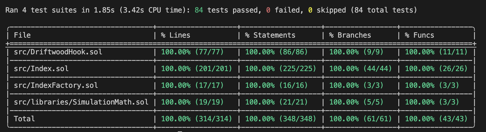

# Driftwood

**A Uniswap v4 hook that turns index portfolio rebalancing (like [Reserve protocol](https://reserve.org/)) into LP yield.**

> Driftwood is the LP position whose impermanent loss is the rebalancing target.

*Built for the Atrium × Uniswap incubator hackathon, track "Impermanent Loss and Yield Systems".*

## The core idea

Driftwood turns index portfolio rebalancing into a source of LP yield.

Index protocols hold baskets of tokens at target weights, and pay to rebalance them when the weights drift — through auctions, MEV-prone swaps, or third-party market makers. Meanwhile the underlying reserves sit idle. Driftwood is a Uniswap v4 hook that deploys these reserves as concentrated liquidity, collects swap fees, and lets organic trading flow do the rebalancing work.

Holders earn swap fees on capital that would otherwise sit idle, while the portfolio rebalances itself through organic swap flow.

### Example: a normal LP's IL = the index's rebalance

Take the index from the demo stand: **1 WETH + 3000 USDT** at an ETH price of \$3000. That is \$3000 + \$3000 — exactly **50/50**, the target weights with a ±5% tolerance.

1. **ETH price rises \$3000 → \$3300.** Now the WETH in the basket is worth \$3300 against \$3000 in USDT — the ETH weight has moved to ~52% against the 50% target. The index needs to *sell a bit of ETH for USDT* to get back to target.
2. **An arbitrageur comes in** and buys the now-pricier ETH out of the pool. The hook deploys the index's reserves as liquidity for this swap: the index gives up some WETH, receives USDT — and its weights move back to 50/50.
3. **Same trade, different meaning.** For a normal LP this is impermanent loss — it earned less than holding while ETH went up. For the index it is the goal: sell the excess ETH and return to 50/50. Same trade, but the index also collects a fee on it.

On top of that, the index keeps the pool fee (0.3% of the volume routed through its liquidity), and `previewBoundsCheck` keeps the weights from drifting past ±5% — so the position never falls into the "loss" zone a normal LP fears.

## Why "Driftwood"

An index's weights constantly "drift" away from target under market pressure. Driftwood (a piece of wood washed ashore by the current) catches that drift and turns it into yield: what looks like a position drifting away with the current to a normal LP is, for an index, arriving at the shore it wanted.

## How it works

Three contracts:

- **[Index](src/Index.sol)** — the index fund. Holds a basket of tokens at target weights (`targetWeightBps`) with a tolerance (`toleranceBps`), reads prices through Chainlink oracles, lends its reserves to the hook, and checks that the weights stay within bounds after a swap.
- **[DriftwoodHook](src/DriftwoodHook.sol)** — the Uniswap v4 hook. In `beforeSwap` it simulates the swap outcome, and if the weights stay within tolerance it borrows the index's reserves and deploys them as JIT liquidity. In `afterSwap` it closes the position and returns the tokens to the index together with its share of the fee.
- **[IndexFactory](src/IndexFactory.sol)** — a factory that deploys indexes through minimal proxies (clones).

### Swap flow

```
Trader → Pool ──► DriftwoodHook.beforeSwap
                       │
                       ▼
        Simulate the swap outcome on the combined liquidity
        (hook's final balances at the new price + fee share)
                       │
                       ▼
        Pool capacity check (enough tokens for take?) ──── no ────┐
                       │ ok                                        │
                       ▼                                           │
        Index.previewBoundsCheck(final balances) ── out of bounds ─┤
                       │ within tolerance                          │
                       ▼                                    JIT skipped
        Index.lendAssets(...) → modifyLiquidity(+L) → settle       │
                       │                                           ▼
                       ▼                              Normal swap against the
        (Uniswap v4 runs the swap through            pool's native liquidity (no JIT)
         the combined liquidity)
                       │
                       ▼
        DriftwoodHook.afterSwap → modifyLiquidity(−L) → take
                       │
                       ▼
        Index.collectAssets() → check weights on the actual balances
                       │
              ┌────────┴────────┐
              ▼                 ▼
        within tolerance    out of bounds
        [JIT succeeded]     [revert WeightOutOfBounds]
```

If at any check step the JIT is not profitable or not safe (a huge swap, weights drifting out of tolerance), the hook simply skips the JIT and the swap goes through the pool's native liquidity. The user's swap is not reverted because of tolerance — the JIT is optional.

## Yield and the holder lifecycle

Yield is not paid out separately — it accrues in the share value. Each successful JIT cycle returns more tokens to the index's reserves than were lent out (by the amount of the pool fee). The reserves grow, the share `totalSupply` does not, so over time each share redeems for a larger slice of the basket.

A participant's lifecycle:

1. **`mint(shares, receiver)`** — you deposit a basket of tokens in the index's current proportions and receive shares. This is your slice of the portfolio.
2. **The capital works.** While you hold the shares, the hook deploys the reserves as JIT liquidity for passing swaps, collects fees, and keeps the weights near target. You don't have to do anything.
3. **`redeem(shares, receiver, minAmountsOut)`** — you burn the shares and take a pro-rata slice of the current reserves (with slippage protection via `minAmountsOut`). Thanks to the accrued fees, this slice is larger than what you deposited at `mint`.

## Safety mechanisms

Driftwood filters toxic flow without auctions:

- **Oracle bounds check.** The index reads prices through Chainlink, checks `answer > 0` and staleness (its own heartbeat per feed), and allows the JIT only if the resulting weights stay within `toleranceBps` of target.
- **Pre-swap simulation + skip.** In `beforeSwap` the hook simulates the outcome on the combined liquidity and asks the index for a predicate. Not worth it → the JIT is skipped, the swap goes through without it.
- **Pool capacity check.** Before lending liquidity, the hook makes sure there will be enough tokens in the pool for the `take` in `afterSwap`.
- **Post-swap assertion.** `collectAssets` re-checks the weights on the actual balances. If the simulation diverged from reality (for example, the oracle price was swapped between `beforeSwap` and `afterSwap`) — revert.
- **Single-flight JIT.** Only one JIT loan is active at a time; `mint`/`redeem` and admin setters are blocked while the loan is open.

## Project status

A working MVP. The JIT cycle runs end-to-end: the index lends liquidity, receives its share of the fee, and the composition stays within tolerance; on huge swaps the JIT is skipped, and on a broken oracle it reverts.

83 tests (0 failed), 100% coverage of the production code in [Index.sol](src/Index.sol) and [DriftwoodHook.sol](src/DriftwoodHook.sol).



## Deployments

Addresses below are taken from the latest `DemoDeploy.s.sol` broadcast runs.

### Base Mainnet (chain id `8453`)

| Contract | Address |
| --- | --- |
| IndexFactory | [`0x5D35e5F7253b2E885C6419ee58CD87b3BF1399E3`](https://basescan.org/address/0x5D35e5F7253b2E885C6419ee58CD87b3BF1399E3) |
| Index (implementation) | [`0xAC949e975caDeC0cb2332Ed2129D5e1Ed0d1Fa72`](https://basescan.org/address/0xAC949e975caDeC0cb2332Ed2129D5e1Ed0d1Fa72) |
| Index ("Demo index" / `DT`) | [`0x4B9F8F380BC68bb5dbEb21051933618A9Be4Db52`](https://basescan.org/address/0x4B9F8F380BC68bb5dbEb21051933618A9Be4Db52) |
| DriftwoodHook | [`0xB45f0258203b6f6cae49dC5036C2021C416540c0`](https://basescan.org/address/0xB45f0258203b6f6cae49dC5036C2021C416540c0) |
| Uniswap v4 PoolManager | [`0x498581fF718922c3f8e6A244956aF099B2652b2b`](https://basescan.org/address/0x498581fF718922c3f8e6A244956aF099B2652b2b) |
| WETH (mock, 18 dec) | [`0x23c406c6C67BEcDe62ca271e50f4c961917e4e2a`](https://basescan.org/address/0x23c406c6C67BEcDe62ca271e50f4c961917e4e2a) |
| USDT (mock, 6 dec) | [`0xB0B0f79d4ed33D44775fCd44523B423ff860Cd07`](https://basescan.org/address/0xB0B0f79d4ed33D44775fCd44523B423ff860Cd07) |
| ETH/USD feed (mock, $3000) | [`0x99Cc103CdFd914220996bd83eB6f0656Dd37Bd76`](https://basescan.org/address/0x99Cc103CdFd914220996bd83eB6f0656Dd37Bd76) |
| USDT/USD feed (mock, $1) | [`0xa71e5E19690EcEF1dEe62D9c20D8655Ff4d8DE90`](https://basescan.org/address/0xa71e5E19690EcEF1dEe62D9c20D8655Ff4d8DE90) |

### Base Sepolia (chain id `84532`)

| Contract | Address |
| --- | --- |
| IndexFactory | [`0xd26fb189c08543Cc0c94E239f2FDE4A6DA954D20`](https://sepolia.basescan.org/address/0xd26fb189c08543Cc0c94E239f2FDE4A6DA954D20) |
| Index (implementation) | [`0x31c628a15792331e1eC8aC3bBb5fBB56aD9cCA02`](https://sepolia.basescan.org/address/0x31c628a15792331e1eC8aC3bBb5fBB56aD9cCA02) |
| Index ("Demo index" / `DT`) | [`0xC167e9b0D5f5A8eAa3a6cfEf9A89d5CCCE3B3733`](https://sepolia.basescan.org/address/0xC167e9b0D5f5A8eAa3a6cfEf9A89d5CCCE3B3733) |
| DriftwoodHook | [`0x35d6e9057511e326c11Def4AFFaeD44947c980c0`](https://sepolia.basescan.org/address/0x35d6e9057511e326c11Def4AFFaeD44947c980c0) |
| Uniswap v4 PoolManager | [`0x05E73354cFDd6745C338b50BcFDfA3Aa6fA03408`](https://sepolia.basescan.org/address/0x05E73354cFDd6745C338b50BcFDfA3Aa6fA03408) |
| WETH (mock, 18 dec) | [`0x430eaF6D6c8d75FFee6222E8FB9717857c92D133`](https://sepolia.basescan.org/address/0x430eaF6D6c8d75FFee6222E8FB9717857c92D133) |
| USDT (mock, 6 dec) | [`0xF3B10Cb6072e5881ACEcfA6F99EaE0f038207158`](https://sepolia.basescan.org/address/0xF3B10Cb6072e5881ACEcfA6F99EaE0f038207158) |
| ETH/USD feed (mock, $3000) | [`0x4dE1ff29aa4B83E77e73c6F865101a1227408a9E`](https://sepolia.basescan.org/address/0x4dE1ff29aa4B83E77e73c6F865101a1227408a9E) |
| USDT/USD feed (mock, $1) | [`0x1B190244841Ce63c260107e4783B64193e8D48A6`](https://sepolia.basescan.org/address/0x1B190244841Ce63c260107e4783B64193e8D48A6) |

## Build and test

The project uses the [Foundry](https://book.getfoundry.sh/) toolkit. If it is not installed yet:

```shell
$ curl -L https://foundry.paradigm.xyz | bash
$ foundryup
```

Clone the repository together with its dependencies (they are wired up as git submodules):

```shell
$ git clone --recurse-submodules <repo-url>
$ cd Driftwood
```

Build, test, and the coverage report:

```shell
$ forge build
$ forge test
$ forge coverage
```

Handy during development:

```shell
$ forge test -vvvv           # detailed trace of calls and reverts
$ forge test --match-test test_swap_reference   # a single test
$ forge fmt                  # formatting
$ forge snapshot             # gas snapshot
```

## Deploy

**Demo deploy**

The demo deploy puts the core contracts (factory, index, and hook) on-chain together with mock tokens (WETH, USDT) and oracles — to bring up a stage stand for the demo without depending on real assets and Chainlink feeds.

1. Copy `.env.example` to `.env` and fill in the variables: the network RPC endpoints and the key for contract verification.

   ```shell
   $ cp .env.example .env
   ```

   ```dotenv
   BASE_SEPOLIA_RPC_URL=https://...
   BASE_MAINNET_RPC_URL=https://...
   ETHERSCAN_API_KEY=...
   ```

2. Load the environment variables and run the script. The argument is the address of the Uniswap v4 PoolManager on the target network.

   ```shell
   $ source .env
   $ forge script script/DemoDeploy.s.sol:DemoDeployScript --rpc-url base-sepolia --broadcast --sig "run(address)" "[PoolManager]" --slow --verify -vvvv --interactives 1
   ```

3. The `--interactives 1` flag opens an input prompt — paste the deployer's private key. The script deploys the tokens, oracles, factory, index, and hook, then prints the contract addresses and the `PoolId` to the console.

## Key files

- [src/Index.sol](src/Index.sol) — the index fund: weights, tolerances, oracles, lend/collect.
- [src/DriftwoodHook.sol](src/DriftwoodHook.sol) — the Uniswap v4 hook: JIT liquidity in `beforeSwap`/`afterSwap`.
- [src/IndexFactory.sol](src/IndexFactory.sol) — the index factory via clones.
- [src/libraries/SimulationMath.sol](src/libraries/SimulationMath.sol) — pure swap-simulation math.
